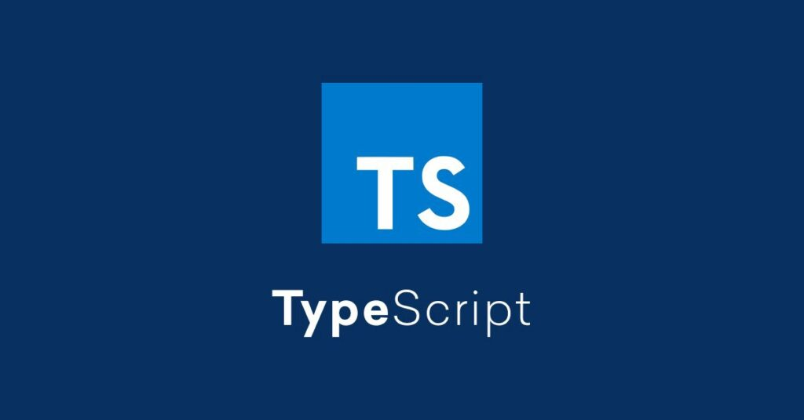

<h1 align="center">Tipagem com Typescript</h1>

## ✨ Tecnologias

Esse projeto foi desenvolvido com as seguintes tecnologias:

- [Typescript](https://www.typescriptlang.org/)

## 💻 Projeto

Alguns mini-projetos em TypeScript para estudar as features da linguagem.

## 🚀 Como executar

- Clone o repositório
- Rode `yarn` para baixar as dependências
- Rode o `yarn dev` para iniciar a aplicação.

Por fim, a aplicação estará disponível no console do seu terminal.

---
Feito com 💜 &nbsp;no bootcamp da Cataline 👋🏻 &nbsp;